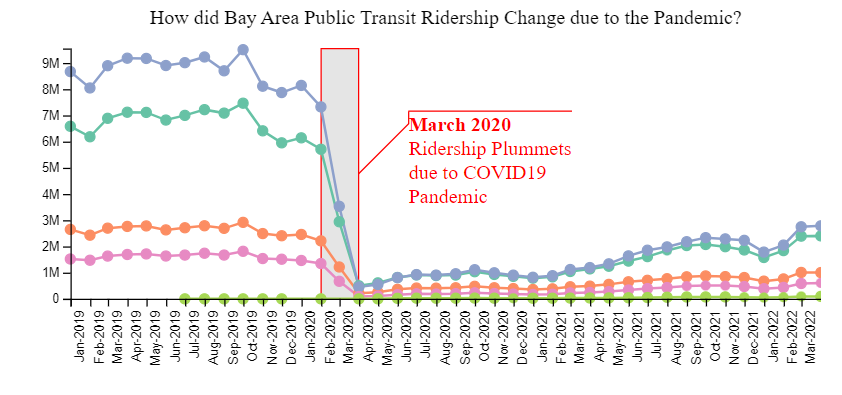
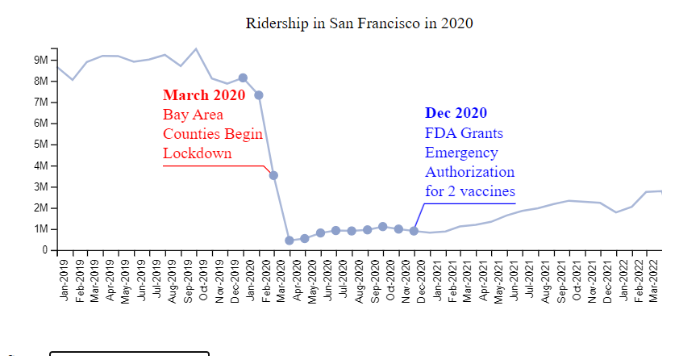
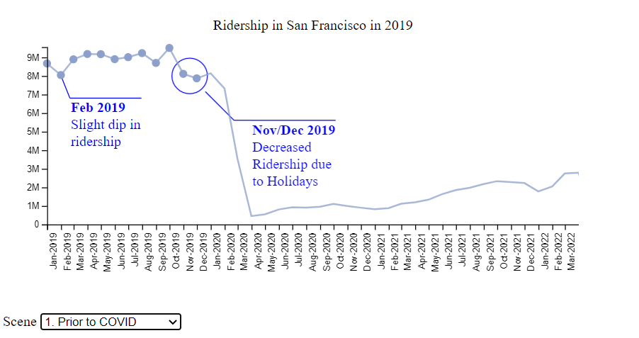
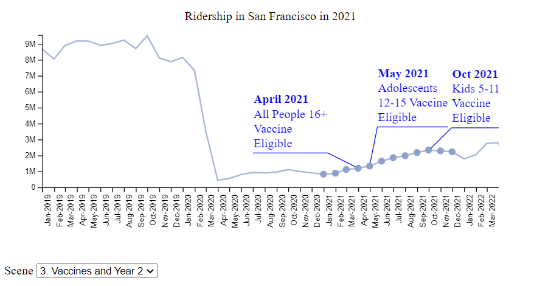
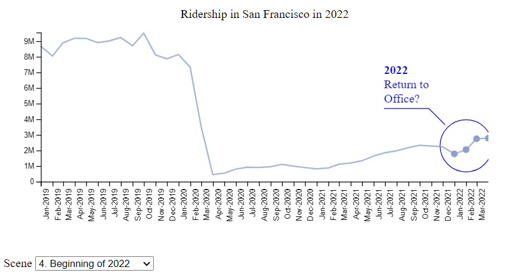
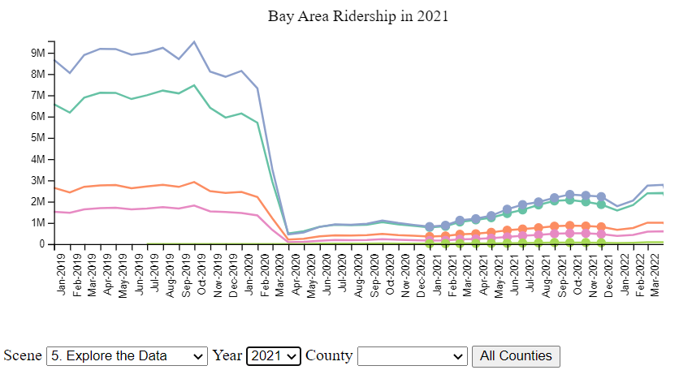
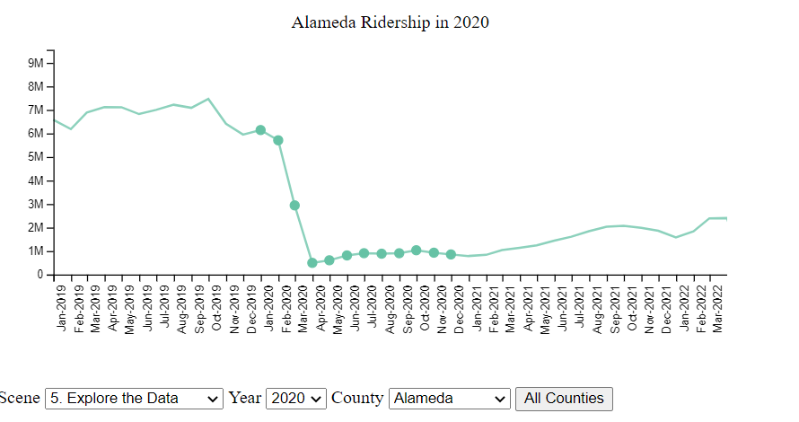

# BART Ridership Narrative Visualization

**NetId**: Kdewitt3

**Student Name**: Kathryn DeWitt

**Course**: CS416 Data Visualization

## Table of Contents

1. [Introduction](#introduction)
1. [Messaging](#messaging)
1. [Narrative Structure](#narrative-structure)
1. [Visual Structure](#visual-structure)
1. [Scenes](#scenes)
1. [Annotations](#annotations)
1. [Parameters](#parameters)
1. [Triggers](#triggers)
1. [Conclusion](#conclusion)
1. [Grading Reference](#grading-reference)

## Introduction

For my narrative visualization, I created a story about public transit ridership in the California Bay Area as influenced by the pandemic using D3 in Javascript. Based on the information I have learned in CS416, I designed a narrative that allows me to communicate my point while also giving the user the freedom to explore the data.

Please note that the [grading reference section](#grading-reference) is a tool that will assist you with grading my responses. For ease, I will link back to the appropriate section of my essay; highlight chunks of code; or include screenshots of the visualization.

> [Click here to go back to the table of contents.](#table-of-contents)

## Messaging

> What is the message you are trying to communicate with the narrative visualization?

The message I am trying to communicate with the narrative visualization is that Bay Area Rapid Transit (BART) ridership has decreased significantly due to the pandemic and has not rebounded. The user can explore this trend by county and station. This is the main finding I found when putting together [a Tableau dashboard for a previous assignment in this class](https://public.tableau.com/views/COVIDsImpactonBARTRidership/FinalDashboard?:language=en-US&publish=yes&:display_count=n&:origin=viz_share_link).

> [Click here to go back to the table of contents.](#table-of-contents)

## Narrative Structure

> Which structure was your narrative visualization designed to follow (martini glass, interactive slide show or drop-down story)? How does your narrative visualization follow that structure? (All of these structures can include the opportunity to "drill-down" and explore. The difference is where that opportunity happens in the structure.)

When designing my narrative, I decided to follow a Martini Glass structure to walk the viewer through San Francisco's ridership data. San Francisco had the highest ridership prior to the pandemic, which makes the drop in 2020 especially stark. Additionally, for those living outside of the Bay Area, San Francisco is a familiar city name. The user first goes through an overview of the data, followed by a presentation showing how BART ridership changed in each calendar year. At scene number 5, the user is free to explore on their own using the drop downs for `year` and `county` (more on how these variables control state [in my section on parameters](#parameters)). I found the Martini Glass structure particularly useful to communicate my message as the paths the user can explore are similar to those of San Francisco.

> [Click here to go back to the table of contents.](#table-of-contents)

## Visual Structure

> What visual structure is used for each scene? How does it ensure the viewer can understand the data and navigate the scene? How does it highlight to urge the viewer to focus on the important parts of the data in each scene? How does it help the viewer transition to other scenes, to understand how the data 
connects to the data in other scenes?

I utilized the same axis structure throughout the visual narrative. While this may make some data more compressed (see Santa Clara, which has only 2 BART stations), it allows the viewer to stay oriented to the scale of the decrease in ridership. Additionally, I utilized gentle transitions of the points to ensure that the viewer did not get disoriented when switching data points between scenes.



For example, switching between the overview scene (above) to the scene showing the pandemic (below), I use the same axes, same colors, and keep a faint outline of the line graph for San Francisco. In the below screenshot, I draw the viewer's attention to the data points in focus through annotations, removing other counties, and changing the title.



> [Click here to go back to the table of contents.](#table-of-contents)

## Scenes

> What are the scenes of your narrative visualization?  How are the scenes ordered, and why?

As part of the Martini Glass structure, I have 5 author directed scenes followed by a scene where the user can explore and drill down.

In scene 0, I provide the user an overview of the data and then draw their attention to the March 2020 decline in public transit ridership. By setting the scene across all Bay Area counties, I invite the viewer to notice trends at a high level.


In scene 1 below, the viewer begins reviewing the ridership data by year for the county of San Francisco alone. Scenes 1-4 will go year by year marking the key COVID-19 milestones on top of ridership data. The chronological ordering of the scenes makes logical sense to the viewer and helps them to walk through the journey. The goal of having scene 1 is to give the viewer a sense of what baseline ridership was prior to 2020.  I chose to leave the trend line in the background of scenes 1-4 to help the viewer see both the big picture trend in ridership while allowing them to focus on the points being emphasized in the current year.



In scene 2 (picture below), the viewer sees the COVID19 annotation on top of ridership data for San Francisco in 2020, which is in red to highlight and emphasize the importance of that data point.


In scene 3, the viewer reviews the pace of vaccination eligibility along with ridership data for San Francisco in 2021. The point here is that vaccine availability did not result in an immediate rebound of ridership.



In scene 4, I display ridership data for San Francisco in 2022 and theorize about the impact of return to work. The point of this scene, which ends in March 2022, is to show ridership has not rebounded to pre-COVID levels.



Finally, the viewer is allowed to freely explore the data via drilling down to different counties and different years. I will talk more about how the user can explore the data in [my section on parameters below.](#parameters)

## Annotations

> What template was followed for the annotations, and why that template? How are the annotations used to support the messaging? Do the annotations change within a single scene, and if so, how and why

I used the `d3-annotations` package and standardized my template for annotations. Below is an example template from scene 1, where I discuss the dip in ridership found in Feb 2019.

```
{
    note: {
      label: "Slight dip in ridership",
      title: "Feb 2019"
    },
    color: ["blue"],
    x: x(new Date("2/1/2019")),
    y: y(8000000),
    dy: 25,
    dx: 10
}
```

In creating the annotation template, I used the principles of data visualization to communicate my message. I used a consistent color scheme (blue for general notes and red for the start of the COVID era to highlight this time point). The consistent color scheme ensures that the user does not become disoriented. Where possible, I had the annotation not cross the line graph of ridership. Additionally, I used the title field as the date (or x value) and the label as the reason this point is highlighted. In order to place the annotations where I wanted, I manually adjusted x, y, dy, and dx.

In on top of the template, I used callouts in 3 specific locations to communicate my message. The first was in scene 0 to emphasize the drop in ridership in March 2020. The second was in scene 1 to provide explanation to the ridership decrease in the November and December; since the explanation applied to two months, it was appropriate to use a callout. Finally, in scene 4, I have an annotation with a callout about return to office for the early months of 2022.

As mentioned above, in scene 0, I have one annotation that appears after a 3 second delay. This change in annotation within a scene is meant to allow the user to first review the graph as a whole then have their attention drawn to the area I want them to focus on.

> [Click here to go back to the table of contents.](#table-of-contents)

## Parameters

> What are the parameters of the narrative visualization? What are the states of the narrative visualization? How are the parameters used to define the state and each scene?

I used the parameters `scene`, `county`, and `year` to control the narrative visualization. Scene worked as a state machine, which drove the values of `county` and `year` for scenes 1-4. In scene 5, I revealed a dropdown box for the user to select the `county` and `year` of interest.

Below the viewer has drilled down to only the `year` 2021 in scene 5.



In another view, the viewer has selected only the `county` of Alameda and the `year` 2020.


> [Click here to go back to the table of contents.](#table-of-contents)

## Triggers

> What are the triggers that connect user actions to changes of state in the narrative visualization? What affordances are provided to the user to communicate to them what options are available to them in the narrative visualization?

- affordance lets user know how to interact w/ them
- need data pt/city name in tool tip
- need ability to highlight county

TODO: affordances/highlight dp

The most basic triggers I utilized to change state are dropdowns and buttons in scene 5, user directed exploration. I used `click`ing on a button to reset to all counties. In selecting `scene`, `county`, and `year`, I used a drop down that utilized an event listener that checked for `change`s.  

> [Click here to go back to the table of contents.](#table-of-contents)

## Conclusion

As this was my first foray into front end web dev, I learned a great deal about how to leverage JS and the d3 library for data visualization. If I had unlimited time, I would have spent additional time and resources to redraw the graph for each scene and county filter. This would have allowed for zooming in the y-axis, which could more effectively illustrate that similar patterns were found in smaller counties.

In an ideal world, I would have also had a secondary chart with COVID19 case rate that would be in discussion with the BART ridership for each county. This was the question I explored in the my Tableau dashboard.

Overall, I believe my narrative visualization helps the user understand that the Bay Area public transit ridership has irrevocably changed due to the pandemic.

> [Click here to go back to the table of contents.](#table-of-contents)

## Grading Reference

The goal of this section is to check all the boxes to make your life (i.e. the grader) easier. Please feel free to use the below table of contents.

**Grading Table of Contents**

<ol type="A">
  <li>URL</li>
  <li>PDF Essay</li>
  <li>Narrative Structure</li>
  <li>Visual Structure</li>
  <li>Scenes and visual Ordering</li>
  <li>Annotations</li>
  <li>Parameters and State</li>
  <li>Triggers</li>
</ol>


### **A. What is the URL of your narrative visualization?**

> [1 point] Does the URL connect to a functioning web page?

Yes. [https://katldewitt.github.io/data_viz_covid_bart/](https://katldewitt.github.io/data_viz_covid_bart/)

### **B. Upload a PDF file essay describing your narrative visualization as required by the assignment instructions.**

> [5 points] Does the essay state what messaging was intended by the narrative visualization?

Yes, see [my section on Messaging above](#messaging).

### **C. Narrative Structure**

> [2 points] Does the essay indicate which structure the narrative visualization was designed to follow (martini glass, interactive slide show or drop-down story)?

Martini glass structure discussed in [my section on narrative structure above](#narrative-structure).

> [3 points] Does the narrative visualization follow that structure?

Yes. [https://katldewitt.github.io/data_viz_covid_bart/](https://katldewitt.github.io/data_viz_covid_bart/)

### **D. Visual Structure**

> [2 points] Does the essay indicate what visual structure is used for each scene?

Yes, discussed in [my section on visual structure above](#visual-structure).

> [1 point] Does the essay indicate how the visual structure ensures the viewer can understand the data?

Yes, using a consistent axes is discussed in [my section on visual structure above](#visual-structure).

> [1 point] Does the essay indicate how highlighting is used to get the viewer to focus on the important parts of the data in each scene?

Yes, using annotations for highlighting is discussed in [my section on visual structure above](#visual-structure).

> [1 point] Does the essay indicate how the visual structure helps the viewer transition to other scenes, to understand how the data connects to the data in other scenes?

Yes, the user of the line and transition effects are discussed in [my section on visual structure above](#visual-structure).

### **E. Scenes and Visual Ordering**

> [2 points] Does the essay identify the scenes of the narrative visualization?

Scene identification in [my section on scenes above](#scenes).

> [1 point] Does the essay discuss ordering (e.g. the order of elements in a chart or the ordering of scenes)?

Scene ordering in [my section on scenes above](#scenes).

> [2 point] Do the charts used as scenes effectively present the data?

Yes. [https://katldewitt.github.io/data_viz_covid_bart/](https://katldewitt.github.io/data_viz_covid_bart/)

### **F. Annotations**

> [2 points] Does the essay discuss annotations?

Annotation discussion in [my section on annotations above](#annotations).

> [1 point] Does the essay discuss a template for the annotations?

Yes, I include a template code and discuss in [my section on annotations above](#annotations).

> [2 points] Are the annotations in the narrative visualization effective and consistent?

Yes. Any deviations from the template are intentional to draw the viewer's eye.
[https://katldewitt.github.io/data_viz_covid_bart/](https://katldewitt.github.io/data_viz_covid_bart/)

### **G. Parameters and States**

> [1 point] Does the essay identify the parameters of the narrative visualization?

Parameters discussed in [my section on parameters above](#parameters).

> [1 point] Does the essay identify the states of the narrative visualization?

States discussed in [my section on parameters above](#parameters).

> [1 point] Does the essay indicate how are the parameters are used to define the state and each scene?

State machine based on parameters discussed in [my section on parameters above](#parameters).

> [1 point] Does the narrative visualization use parameters to control its state?

Yes. [https://katldewitt.github.io/data_viz_covid_bart/](https://katldewitt.github.io/data_viz_covid_bart/)

> [1 point] Does the narrative visualization use parameters to control each scene?

Yes. [https://katldewitt.github.io/data_viz_covid_bart/](https://katldewitt.github.io/data_viz_covid_bart/)

### **H. Triggers**

> [2 points] Does the essay indicate the triggers that connect user actions to changes of state in the narrative visualization?

See my discussion on triggers in [the section on triggers above](#triggers).

> [1 point] Does the essay indicate what affordances are provided to the user to communicate to them what options are available to them in the narrative visualization?

See my discussion on affordances in [the section on triggers above](#triggers).

> [1 point] Does the narrative visualization implement and respond to user events properly?

Yes, but the hit boxes are small for the tooltip. [https://katldewitt.github.io/data_viz_covid_bart/](https://katldewitt.github.io/data_viz_covid_bart/)

> [1 point] Does the narrative visualization make any effort at all to communicate what options are available to the user?

Yes; annotation as affordance and buttons/drop downs. [https://katldewitt.github.io/data_viz_covid_bart/](https://katldewitt.github.io/data_viz_covid_bart/)