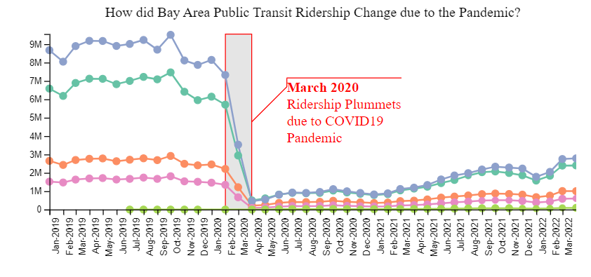

# Visualizing Changes in Public Transit Usage in SF Bay Area During the COVID-19 Pandemic

## Introduction: COVID-19's Impact on BART Ridership

The Bay Area Rapid Transit (BART) system connects five Bay Area counties. Prior to the COVID19 Pandemic, ridership consisted of over 400,000 trips on an average weekday ([source Bart.gov](https://www.bart.gov/sites/default/files/docs/2019%20BARTFacts2019%20FINAL.pdf)). Starting in March 2020, BART ridership decreased dramatically due to the social distancing mandates.

As part of CS416 Data Visualization, a graduate level course at the University of Illinois Urbana-Champaign's Master of Computer Science program, I created two visualizations in the Summer of 2022 to explore the relationship. I used tableau to create a dashboard as well as JavaScript to create a narrative visualization. The goal of both visualizations is to put county-level COVID data in communication with station-level ridership data to allow the end user to explore the story of how COVID and public transit in the Bay Area.

## Table of Contents

1. [Narrative Visualization](#narrative-visualization-javascript)
1. [Tableau Dashboard](#tableau-dashboard-url)
1. [Data Sources](#data-sources)
    1. [COVID Data from California Department of Public Health](#data-source-1-covid-data)
    2. [BART Ridership Data](#data-source-2-bart-ridership-data)
    3. [BART Station Location Shape Files](#data-source-3-bart-geospatial-data)
    4. [California County Shape Files](#data-source-4-ca-county-shape-file)
1. [A Note on the Formal End of COVID-19 Public Health Emergency](#a-note-on-the-formal-end-of-covid-19-public-health-emergency)

## **[Narrative Visualization (JavaScript)](https://katldewitt.github.io/data_viz_covid_bart/)**

### Underlying Data Refresh

Narrative Visualization last refreshed on 5/6/22 with data through 5/6/23

## **[Tableau Dashboard url](https://public.tableau.com/views/COVIDsImpactonBARTRidership/FinalDashboard?:language=en-US&publish=yes&:display_count=n&:origin=viz_share_link)**

### Data Refresh

Narrative Visualization last refreshed on 6/5/22 with data through 5/23/22

## Data Sources

### Data Source #1 COVID Data

**Url:** [CA CDPH](https://data.ca.gov/dataset/covid-19-time-series-metrics-by-county-and-state)

**Key Data Documentation Notes:**

- "Data is from the California COVID-19 State Dashboard at <https://covid19.ca.gov/state-dashboard/>"
- "NOTE: Data is being updated on Tuesdays and Fridays."
- "Data on cases, deaths, and testing is not reported on weekends or state holidays. This data is reported on the first day following the weekend or holiday. All metrics include people in state and federal prisons, US Immigration and Customs Enforcement facilities, US Marshal detention facilities, and Department of State Hospitals facilities. Members of California's tribal communities are also included."

**Clean Up Requirements:**

1. Remove State level sums (tableau will calculate this manually)
2. Keep only Bay Area counties with Bart Stations
3. Roll up to the daily level

**Used in:** Tableau Dashboard and JavaScript Narrative Visualization

-----

### Data Source #2 BART Ridership Data

**Url:** [Bay Area Rapid Transit](https://www.bart.gov/about/reports/ridership) > Hourly Data

**Key Data Documentation Notes:**

- "For those of you looking to take a deeper dive into BART’s data - check out our hourly trip datasets. These files will allow you to analyze trips between all stations in the BART system by hour. The data is organized in the following columns: Date, Hour (24-hour clock), Origin Station, Destination Station, Number of Exits. All stations are abbreviated using the 4-Letter station codes, please refer to the station name abbreviations (.xls) for translation."

**Clean up Requirements:**

1. Crosswalk between station code and the Station Name
2. Include Station County as a linkage variable
3. Roll up to the monthly level (at the exit-entrant level)

**Used in:** Tableau Dashboard and JavaScript Narrative Visualization

-----

### Data Source #3 BART Geospatial Data

**Url:** [Bay Area Rapid Transit](https://www.bart.gov/schedules/developers/geo) > KML Format

**Key Data Documentation Notes:** n/a

**Clean up Requirements:**

1. Crosswalk between Ridership Data (Station Code) and geographical Bart Station location

**Used in:** Tableau Dashboard Only

-----

### Data Source #4 CA County Shape File

**Url:** [CA Data.gov](https://data.ca.gov/dataset/ca-geographic-boundaries) > CA County Boundaries

**Key Data Documentation Notes:** n/a

**Clean up Requirements:**

1. [Spatial join in Tabelau](https://www.tableau.com/about/blog/2018/8/perform-advanced-spatial-analysis-spatial-join-now-available-tableau-92166)

**Used in:** Tableau Dashboard Only

-----

## A Note on the Formal End of COVID-19 Public Health Emergency
