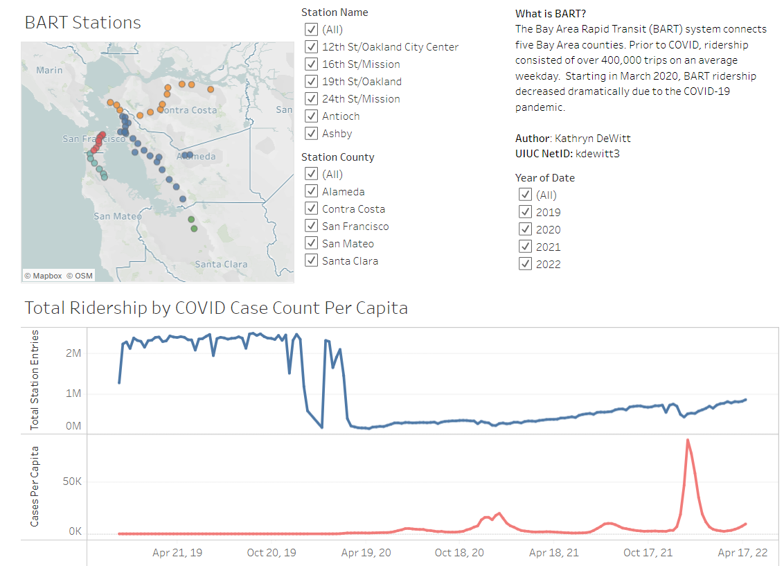

# Bay Area Public Transit Ridership during COVID 19 Narrative Visualization

**NetId**: Kdewitt3

**Student Name**: Kathryn DeWitt

**Course**: CS416 Data Visualization

## Introduction

**[Tableau Dashboard url](https://public.tableau.com/views/COVIDsImpactonBARTRidership/FinalDashboard?:language=en-US&publish=yes&:display_count=n&:origin=viz_share_link)**

The data are sourced from [Bay Area Rapid Transit](https://www.bart.gov/about/reports/ridership), under the Hourly Data for years 2019 through 2022. I processed the data in python using `100_bart_cleanup.py` and `103_ridership_rollup.py`, both of which are available on [github here](https://github.com/katldewitt/data_viz_covid_bart).

## Responses to Questions on Narrative Visualization

### *What is one question that the dashboard can answer by utilizing two or more simultaneously displayed charts?*

Question: How did San Francisco county's BART stations' ridership change overtime relative to COVID case count per capita during the Omicron wave in winter 2021-2022?

Answer: We notice that ridership dipped slightly during the Omicron surge in the end of 2021 and beginning of 2022, but this may be due to the holiday period when ridership typically is lower. Overall, it does not appear that the omicron spike discourage ridership in a significant way given the continued upward trend in January that may be related to the push to return to office.

How: The three charts work in harmony to provide this information. The map demonstrates the geographical layout of the stations in SF, while the COVID Case count illustrates when the omicron spike occurred. Finally, the Ridership chart demonstrates the actual result of the question (the drop relative the previous few weeks). I utilized cross filtering to get this data by subsetting the years to 2021 and 2022 and the county to San Francisco.

### *How does the layout of these charts promote visual understanding of the data across multiple charts? Make sure your explanation describes color consistentcy, alignment and any other ways the layout improves visual understanding.*

Based on the work of Cleveland and McGill on Graphical Perception, we know that the optimal way to present information is to provide an overview of the data first, then allow for zooming and filtering, and finally allow the user to have details on demand.

In order to provider a meaningful overview of the data, I start the user with 4 years of COVID and BART data as well as a geographic overview of the SF Bay Area. I intentionally include the map in the upper left as one of the first items your eye gravitates to to allow the user to get a sense of where they are in the world. Given I use the abbreviation BART frequently, I included a high level description in words on the dashboard. I specifically included data from 2019 to allow the user to get a big overview of what ridership was like prior to the pandemic. I aligned the chart containing my COVID cases and ridership to use the same date axis to put the differing data sources in context with each other. I also chose to use a longer segment of the dashboard for this graph to allow the data to not be too compressed. Some may critique the number of filters that I have included on the dashboard, but I specifically included three filters to allow the user to explore, zoom, and filter. The user may first be curious about their county of residence, but later want to look specifically at the station they ride to everyday. The alignment of having two thirds in the upper half of the diagram for  the filters allows the user to centralize their clicks when filtering for optimal user experience.

### *How does your dashboard provide details on demand?*

I've added a tooltip that allows the user to see the Station Name, the County, the total number of COVID deaths in the time period, and the total number of station entries. The tool tip allows the end use to explore which stations are more populous before interacting more.

### *Indicate which chart is the "first" chart. Then justify the choice of this chart type, its axes and marks based on the data variables it shows.*

The first chart is the two line graphs on the bottom half of the visualization that includes two sets of axes for two continuous quantitative variables measured against the date of the year. Given the dependent variables are quantitative and continuous and the independent variable is quantitative and continuous, I should use a line graph (lecture 3.1.3 Charts). There are values between each week point since the data are continuous, which justifies use of a connected line. A line graph benefits from position when helping the human review the data.

### *Indicate which chart is the "second" chart. Then justify the choice of this chart type, its axes and marks based on the data variables it shows.*

The second chart is my map in the upper left hand corner that demonstrates the geography of the BART Stations and provides detail about which stations are included in my first chart. I incorporated geographic data as well discrete, unordered data (county, station name). Given the geographic nature of the stations, it makes sense to utilize a map. The color coordination by county is a crucial indicator to help the user orient themselves to the geography of the Bay Area. Given position is one of the strongest visual mapping of nominal data, I strongly leverage position and color to indicate station level and county level information.

### *How does your dashboard support cross-filtering between these two charts?*

I support cross-filtering of station county, station name, and year. If someone selects a particular county, the stations in that county are the only ones listed in the map and both graphs limit to the ridership and case count of that county. An additional detail is that my second filter, station name, will subset to only relevant options (i.e. only stations within that county). I added a filter for year as well to allow users to turn off the 2019 ridership data once they understand the previous way the BART system used to operate.

### *Challenges of designing this chart*

1. Since the COVID Data are at the county level and reported on biweekly basis (1 time every 2 weeks), I decided to use the weekly total to ensure artificial spikiness was not introduced into the data.
2. Additionally, the population of each county varies, which means that a few thousand COVID cases in a smaller county may be a different signal than a more populous county. For this reason, I normalized the data to be cases per capita (Case count / population * 100,000).
3. Inclusion of the 2019 data for ridership was intentional to allow the user to see the drastic decrease in the ridership. However, this makes the graph axes very spikey. I attempted to use a year filter to allow the user to turn this off once they understand the big picture.

### Tutorials Used in Tableau

1. https://community.tableau.com/s/news/a0A4T000001v7SCUAY/dual-axis-mapping-many-ways
2. https://community.tableau.com/s/question/0D54T00000C6SBCSA3/getting-tableau-county-info-for-plotted-latlong
